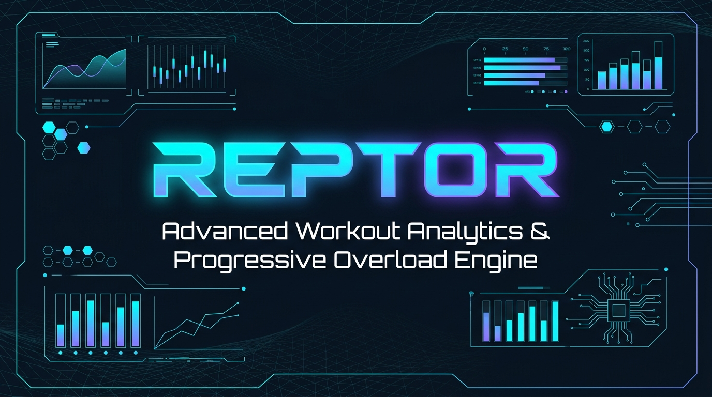
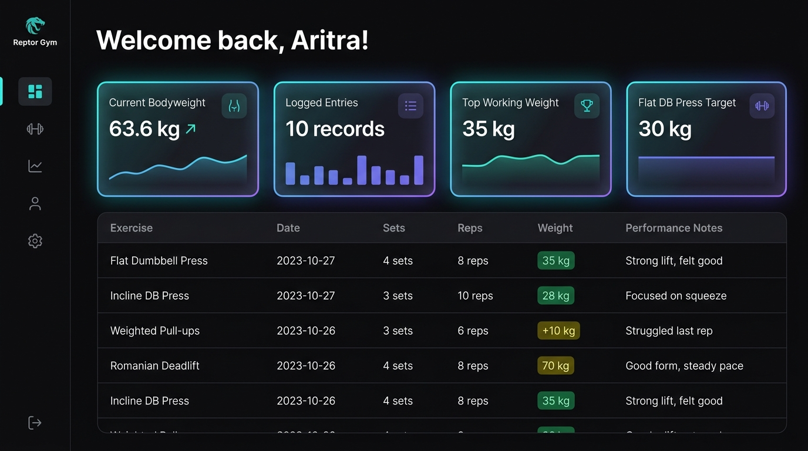
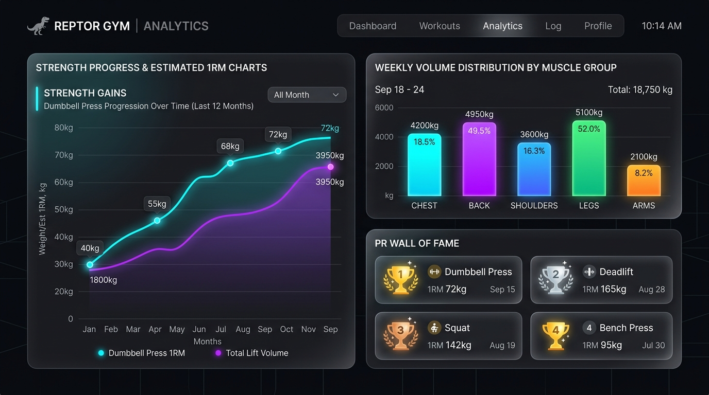
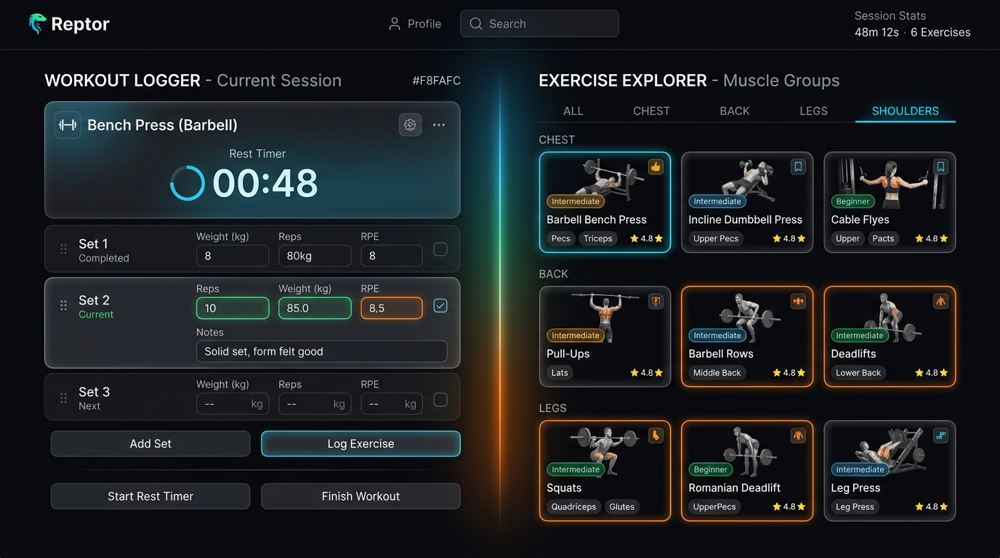

# Reptor — Gym Analytics & Progressive Overload Engine

<div align="center">



[](https://fastapi.tiangolo.com)
[](https://react.dev)
[](https://www.typescriptlang.org)
[](https://vitejs.dev)
[](https://tailwindcss.com)
[](https://python.org)
[](LICENSE)

<p align="center">
  <b>A modern, high-performance web platform for progressive overload tracking, dumbbell pressing analytics, strength progression curves, and AI-assisted workout logging.</b>
</p>

[Key Features](#-key-features) • [Screenshots](#-screenshots--ui-showcase) • [Architecture](#-architecture) • [Quick Start](#-quick-start-guide) • [API Reference](#-api-reference) • [Deployment](#-deployment-guide)

</div>

---

## 📖 Overview

**Reptor** is a full-stack gym analytics application built to help athletes, lifters, and fitness enthusiasts monitor progressive overload with precision. Built with a high-throughput **FastAPI** backend and a sleek, reactive **React 19 + Vite + Tailwind CSS** frontend, Reptor delivers instant feedback on bodyweight adjustments, working weight records, 1RM estimations, and volume distribution across muscle groups.

---

## ✨ Key Features

- 🏋️ **Progressive Overload Tracking**: Real-time monitoring of working sets, target weights (e.g. Flat DB Press progression), and volume loads.
- 📊 **Automated Pandas Data Pipeline**: FastAPI backend processes workout logs from CSV datasets with automated data cleaning and schema validation.
- ⚡ **Interactive Workout Logger**: Log sets, reps, weight (kg), and RPE ratings with a built-in customizable Rest Timer and audio cues.
- 📈 **Visual Strength Analytics**: Dynamic charts visualizing estimated 1RM progression curves and weekly volume per muscle split (Push / Pull / Legs).
- 🏆 **Personal Records (PR) Wall**: Dedicated showcase highlighting top historical lifts, milestones, and personal bests.
- 🔗 **Google Stitch MCP Integration**: Native Model Context Protocol (MCP) proxy endpoint enabling external AI agents and tools to query workout data.
- 🌌 **High-Aesthetic Dark UI**: Custom glassmorphism interface with smooth Framer Motion micro-animations and responsive layouts.

---

## 📸 Screenshots & UI Showcase

### 1. Main Dashboard & Progressive Overload Feed
Real-time summary cards, current bodyweight metrics, working weight benchmarks, and searchable Pandas workout logs.



---

### 2. Strength Analytics & Estimated 1RM Progression
Detailed visual breakdown of strength trends, muscle group volume distribution, and PR achievements.



---

### 3. Workout Logger & Exercise Library
Real-time session logging with active set tracking, RPE ratings, and instant exercise lookup.



---

## 🏗️ Architecture

```mermaid
graph TD
    subgraph Frontend ["Frontend (React 19 + Vite + Tailwind CSS)"]
        UI[App Layout & Pages]
        Query[TanStack React Query Cache]
        Router[React Router 7]
        API_Client[Axios / Fetch API Client]
        UI --> Query
        UI --> Router
        Query --> API_Client
    end

    subgraph Backend ["Backend (FastAPI + Python 3.12)"]
        FastAPI_App[FastAPI Server :8000]
        CORS[CORS Middleware]
        Workouts_Router[/api/workouts Router]
        Stitch_Router[/api/stitch Router]
        Pandas_Engine[Pandas Data Processing]
        
        FastAPI_App --> CORS
        FastAPI_App --> Workouts_Router
        FastAPI_App --> Stitch_Router
        Workouts_Router --> Pandas_Engine
    end

    subgraph Storage ["Data Sources & External APIs"]
        CSV[(workout_data.csv)]
        SQLite[(reptor.db / SQLite)]
        Stitch_MCP[Google Stitch MCP Server]
        
        Pandas_Engine --> CSV
        FastAPI_App --> SQLite
        Stitch_Router --> Stitch_MCP
    end

    API_Client -->|JSON REST Requests| FastAPI_App
```

---

## 🛠️ Tech Stack

| Layer | Technology | Description |
|---|---|---|
| **Frontend Framework** | React 19 + Vite 8 | Ultra-fast HMR and optimized production bundles |
| **Language** | TypeScript | Full end-to-end type safety |
| **Styling & Icons** | Tailwind CSS 4 + Lucide React | Modern glassmorphism dark mode UI & icons |
| **Animations** | Framer Motion | Smooth transitions and micro-interactions |
| **State & Cache** | TanStack React Query 5 | Asynchronous data fetching, caching, and syncing |
| **Backend Framework** | FastAPI (Python 3.12) | High-performance asynchronous REST API |
| **Data Engine** | Pandas & SQLAlchemy | CSV ingestion, data cleaning, and relational models |
| **Agent / MCP** | Stitch MCP Protocol | Model Context Protocol gateway for AI agent tools |
| **Containerization** | Docker & Docker Compose | Multi-container setup for easy deployment |

---

## 🚀 Quick Start Guide

### Prerequisites
- **Node.js**: v18.0 or higher
- **Python**: v3.10, v3.11, or v3.12
- **Git**

---

### 1. Clone the Repository
```bash
git clone https://github.com/aritradey0509/Reptor.git
cd Reptor
```

---

### 2. Backend Setup (FastAPI)

```bash
# Navigate to backend directory
cd backend

# Create and activate virtual environment
python -m venv .venv
# On Windows:
.\.venv\Scripts\activate
# On macOS/Linux:
source .venv/bin/activate

# Install dependencies
pip install -r requirements.txt

# Create your .env file
cp .env.example .env

# Run FastAPI development server
python -m uvicorn app.main:app --reload --port 8000
```
Backend API will be available at: **http://127.0.0.1:8000**
Interactive API Swagger Docs: **http://127.0.0.1:8000/docs**

---

### 3. Frontend Setup (React + Vite)

```bash
# In a new terminal, navigate to frontend directory
cd frontend

# Install Node dependencies
npm install

# Create your frontend .env file
cp .env.example .env

# Start Vite development server
npm run dev
```
Frontend application will be accessible at: **http://127.0.0.1:5173**

---

## 🐳 Docker Setup

Run the entire full-stack application with a single command using **Docker Compose**:

```bash
docker-compose up --build
```

- **Frontend**: `http://localhost:5173`
- **Backend API**: `http://localhost:8000`

---

## 📡 API Reference

| Method | Endpoint | Description | Response |
|---|---|---|---|
| `GET` | `/` | API Root Welcome | JSON Status message |
| `GET` | `/health` or `/api/health` | Health Check | `{"status": "ok", "service": "..."}` |
| `GET` | `/api/workouts` | Fetch cleaned workout dataset | `{"data": [{ "exercise": "...", ... }]}` |
| `GET` | `/api/stitch/status` | Stitch MCP Server status | `{"status": "configured", ...}` |
| `POST` | `/api/stitch/query` | Proxy JSON-RPC query to Stitch MCP | JSON Response from MCP Server |

---

## 🌐 Deployment Guide

### Deploying Frontend (Vercel / Netlify / GitHub Pages)
1. Push repository to GitHub.
2. Import repository on [Vercel](https://vercel.com).
3. Set **Root Directory** to `frontend`.
4. Set Environment Variable:
   - `VITE_API_BASE_URL` = `https://your-backend-api.onrender.com/api`
5. Click **Deploy**. SPA routing rewrite is pre-configured via `frontend/vercel.json`.

### Deploying Backend (Render / Railway / Fly.io)
1. Link repository to [Render](https://render.com).
2. Use the provided blueprint file `backend/render.yaml` or create a **Web Service**:
   - **Root Directory**: `backend`
   - **Build Command**: `pip install -r requirements.txt`
   - **Start Command**: `uvicorn app.main:app --host 0.0.0.0 --port $PORT`
   - **Python Version**: `3.12.0`

---

## 📁 Directory Structure

```text
Reptor/
├── backend/
│   ├── app/
│   │   ├── models/          # Database models (User, Workout)
│   │   ├── routers/         # API Route Handlers (workouts, stitch)
│   │   ├── services/        # Business logic & Stitch MCP client
│   │   ├── config.py        # Settings and environment configs
│   │   ├── database.py      # SQLAlchemy DB engine
│   │   └── main.py          # FastAPI application entry point
│   ├── data/
│   │   └── workout_data.csv # Gym log dataset
│   ├── Dockerfile           # Backend container definition
│   ├── render.yaml          # Render cloud deploy config
│   ├── Procfile             # Web server entry for cloud hosting
│   └── requirements.txt     # Python dependencies
├── frontend/
│   ├── public/              # Static public assets
│   ├── src/
│   │   ├── components/      # Reusable UI components (analytics, layout, workout)
│   │   ├── pages/           # Application views (Dashboard, Analytics, Log, etc.)
│   │   ├── routes/          # React Router setup
│   │   ├── services/        # API client & exercise data
│   │   ├── types/           # TypeScript interfaces & definitions
│   │   ├── App.tsx          # Root app component
│   │   ├── index.css        # Tailwind CSS 4 & glassmorphism theme
│   │   └── main.tsx         # React DOM mount point
│   ├── Dockerfile           # Frontend container definition
│   ├── vercel.json          # SPA routing config for Vercel
│   ├── package.json         # Node dependencies & scripts
│   └── vite.config.ts       # Vite bundler config
├── docs/
│   └── screenshots/         # HD visual UI previews and banners
├── docker-compose.yml       # Full stack container orchestration
├── LICENSE                  # MIT License
└── README.md                # Project documentation
```

---

## 🤝 Contributing

Contributions, issues, and feature requests are welcome!
Feel free to check the [issues page](https://github.com/aritradey0509/Reptor/issues).

1. Fork the Project
2. Create your Feature Branch (`git checkout -b feature/AmazingFeature`)
3. Commit your Changes (`git commit -m 'Add some AmazingFeature'`)
4. Push to the Branch (`git push origin feature/AmazingFeature`)
5. Open a Pull Request

---

## 📄 License

Distributed under the **MIT License**. See [`LICENSE`](LICENSE) for more information.

---

<div align="center">
  <b>Built with ❤️ by <a href="https://github.com/aritradey0509">Aritra Dey</a></b>
</div>
